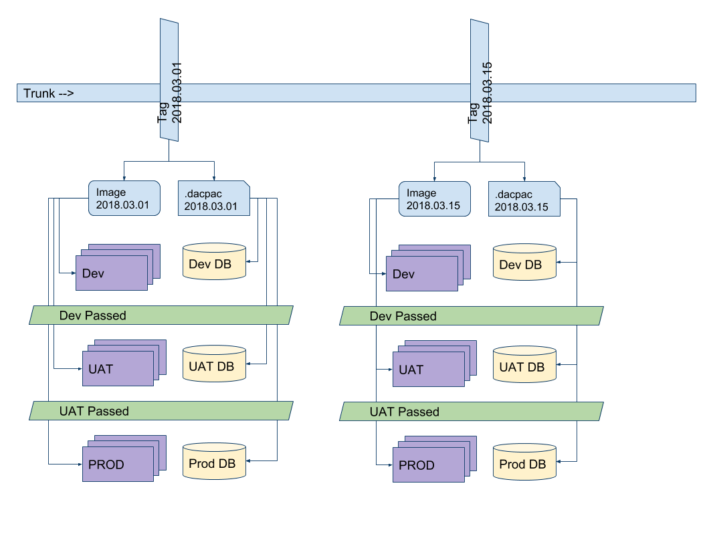

# Continuous Integration with Quandis Business Objects

Quandis implements continuous integration using some key concepts:

## Standing up a development environment

- Source code is deployed to development machines only, and a tag name is created using a `YYYY.MM.DD.HH.MI` syntax
  - Data tier code is deployed via Powershell and SqlPublish
  - Application code is deployed via Powershell and MSDeploy
- Upon **passing integration testing**, the development machine is **imaged** (AWS, Azure, or VM, depending on the environment)
  - the .dacpac used for the database deployment is source controlled

## Standing up a UAT, Staging or Production environment

- The target database is updated from the development environment's .dacpac (Powershell + SqlPublish)
- Virtual server(s) are spun up from an image created after the development environment passed integration testing
  - the launch process shall tag the machine with the environment it is being spun up for
  - a post-launch Powershell script shall change the database connection string to target the database matching the environment tag
  - all other configuration changes are implement by QBO configuration monitoring

